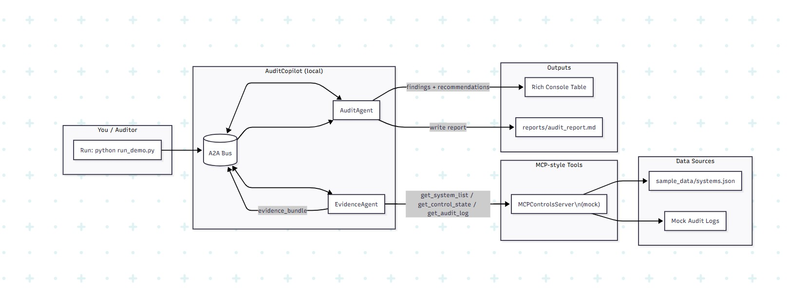

# AuditCopilot – Design Overview

## 1. Purpose
**AuditCopilot** is a lightweight educational prototype that demonstrates how autonomous AI agents can exchange structured audit evidence and generate findings using two emerging interoperability ideas:

- **MCP (Model Context Protocol)** — a standardized interface for exposing tool capabilities to AI agents.  
- **A2A (Agent-to-Agent) Messaging** — a pattern for structured communication between cooperating agents.

The goal is to illustrate how an auditor-style agent could gather system evidence, analyze risks, and output a concise report.

---

## 2. Why MCP Matters

Modern AI systems like Large Language Models (LLMs) are powerful, but they have one big limitation — they mostly know what they learned during training.  
They don’t automatically have access to **live data**, **company systems**, or **specialized tools**.  
This means that, on their own, they can’t always give the most accurate or up-to-date answers.

The **Model Context Protocol (MCP)** solves this problem by creating a **standard way for AI models to connect with real-world data and tools**.  
With MCP, an AI doesn’t just “guess” or rely on memory — it can directly fetch information, run checks, or use APIs that it’s allowed to access.  

This makes AI systems **more relevant, trustworthy, and useful** in practical settings.

> *Reference: [Hugging Face MCP Course – Unit 1: Introduction](https://huggingface.co/learn/mcp-course/unit1/introduction).*

---

## 3. The Integration Problem (M×N vs M+N)

Before MCP, connecting AIs to external tools was messy.  
Imagine you have **M AI apps** (chatbots, audit agents, copilots) and **N external tools** (databases, dashboards, or APIs).

### Without MCP – the M×N Problem
Every AI app would need a **custom connection** to every tool — that’s **M × N integrations** to build and maintain.  
It quickly becomes expensive and hard to manage — each integration behaves differently, needs updates, and breaks over time.

### With MCP – the M+N Solution
MCP introduces a **common language** for these connections.  
Each AI app just needs to know how to talk to MCP once (the *client* side),  
and each tool or data source only needs to implement MCP once (the *server* side).  

Now, instead of M×N separate bridges, you only need **M + N** — dramatically simpler and easier to maintain.

> *Reference: [Hugging Face MCP Course – Unit 1: Key Concepts](https://huggingface.co/learn/mcp-course/unit1/key-concepts).*

---

## 4. High-Level Architecture

Below is the system diagram that summarizes how the main components interact:



---

## 5. Key Concepts

### Model Context Protocol (MCP)

**Technical view:**  
MCP defines a **tool interface** that lets AI agents safely call structured APIs.

In this demo:
- `MCPControlsServer` acts as a **mock MCP provider**.  
- It exposes methods such as:  
  - `get_system_list`  
  - `get_control_state`  
  - `get_audit_log`  
- These simulate system metadata, control states, and audit logs from external environments.

This helps the **EvidenceAgent** interact with “systems” in a reproducible, schema-driven way.

### Agent-to-Agent (A2A) Messaging

**Technical view:**  
A2A defines how multiple agents exchange messages via a shared bus.

In this prototype:
- The **A2A Bus** is a simple in-memory message queue.  
- **EvidenceAgent** fetches and packages evidence bundles.  
- **AuditAgent** consumes those bundles, analyzes risks, and generates recommendations.  
- The message schema (`evidence_bundle`, `findings`, etc.) mimics how independent agent processes could coordinate in a distributed system.

## 6. Components

| Component | Role | Notes |
|------------|------|-------|
| **A2A Bus** | Message transport between agents | Handles serialized audit messages |
| **EvidenceAgent** | Gathers evidence via MCP tools | Produces structured JSON evidence |
| **AuditAgent** | Consumes evidence and performs rule-based analysis | Writes rich table + Markdown report |
| **MCPControlsServer (mock)** | Simulated MCP tool endpoint | Supplies system data & control states |
| **sample_data/systems.json** | Static system metadata | Acts as mock evidence source |
| **run_demo.py** | Orchestrator script | Launches both agents locally |

---

## 7. Execution Flow

1. The user (auditor) runs:
   ```bash
   python run_demo.py
2. The A2A Bus is initialized.
3. EvidenceAgent requests data from the mock MCP server.
4. AuditAgent consumes the evidence and identifies issues.
5. Both agents communicate through the A2A Bus.
6. The system prints a summary table to the console (using rich) and saves a report to:
   reports/audit_report.md

## 8. Example Output

Console view:
| System               | Env     | Owner         | Issues                                  |
|----------------------|---------|---------------|-----------------------------------------|
| PaymentsService      | prod    | payments-team | TLS disabled, No authentication on APIs |
| CatalogService       | staging | catalog-team  | Backups disabled                        |
| NotificationService  | prod    | growth-team   | No encryption at rest                   |

